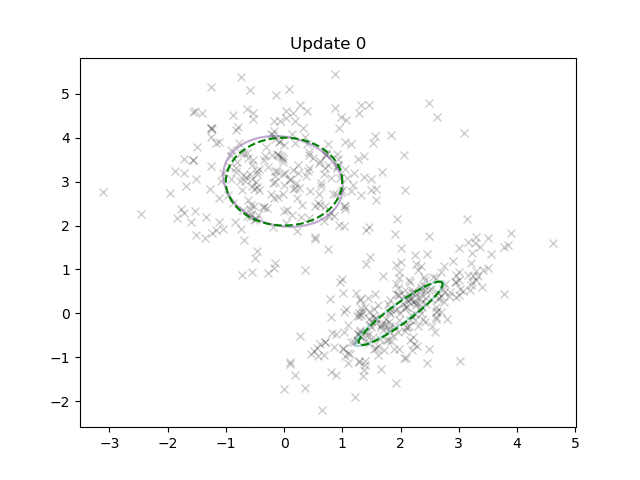

# 4YP
Repo for experiment code from project investigating single sample gradient estimation in variational inference.

### 9/3/2021
Most up to date, useful code in March directory.

`run_GMM_CAVI_unknown_cov` runs a pure CAVI GMM cluster fitting algo

`run_GMM_GD_m_only_unknown_cov` uses CAVI to pretrain a model (finding distributional parameters for component weights, covs and means), then shifts the Gaussian means randomly and retrains them (distributional parameter of mean only) using TRUE gradient descent  

Next steps:

- Turn GMM into a class, should be a lot cleaner, no more functions with 10+ arguments etc
- Update CAVI for an implementation with known covariance (simpler to do GD/SGD, comparisons)
- Get true GD working for known-cov model for all distributional params

### 28/1/2021
Co-ordinate variational inference for a Gaussian mixture model:
https://colab.research.google.com/drive/1JrLIbMR4OrrBDVjIrJX8tKpMRhM-_8Wd?usp=sharing

`GMM_var_inf_Bishop` contains an updated script for batch GD -- this works better than the script in `GMM`, which I am leaving alone for the time being.

N.b. The above notebook requires `MM_var_inf_Bishop/utils.py`

VAE Colab notebook from earlier is here:
https://colab.research.google.com/drive/163uMDyCo96dIqItTlN9gW2oGa2zrDOyp?usp=sharing
